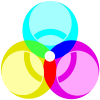

# Pigment
Pigment is a painting application that takes inspiration from cellular automata and falling sand games. 
Your paintbrush lays down pixels that don't quite like to stay in one place. Much of their behavior can be finely adjusted, 
but doing so often results in unexpected emergent properties.

What do I use Pigment for? 
- a new psychadelic album cover
- you're a dotcom company in the late 90s and you need a new logo
- testing the limits of your CPU
- meditation
- inspiration
- fun

This app was built with vanilla javascript, html, and css - mainly as a challenge to myself. 
No other 3rd party modules. Transpiling with Babel, bundling with Webpack.

# Features
- simple interface for in-browser drawing
- intuitive menu system 
- performance options, including dynamic particle removal to prevent stuttering
- save / load presets from local storage

## Planned Features
- Better performance with WebGL compute shaders
- Actual cellular automata (i.e., Conrad's game of life)
- Save paintbrushes to user profile (instead of local storage)
- Share brushes in a central hub where users can 'like' and download other's paintbrushes
- Ambient music that plays dynamically while user is drawing (easy!)
